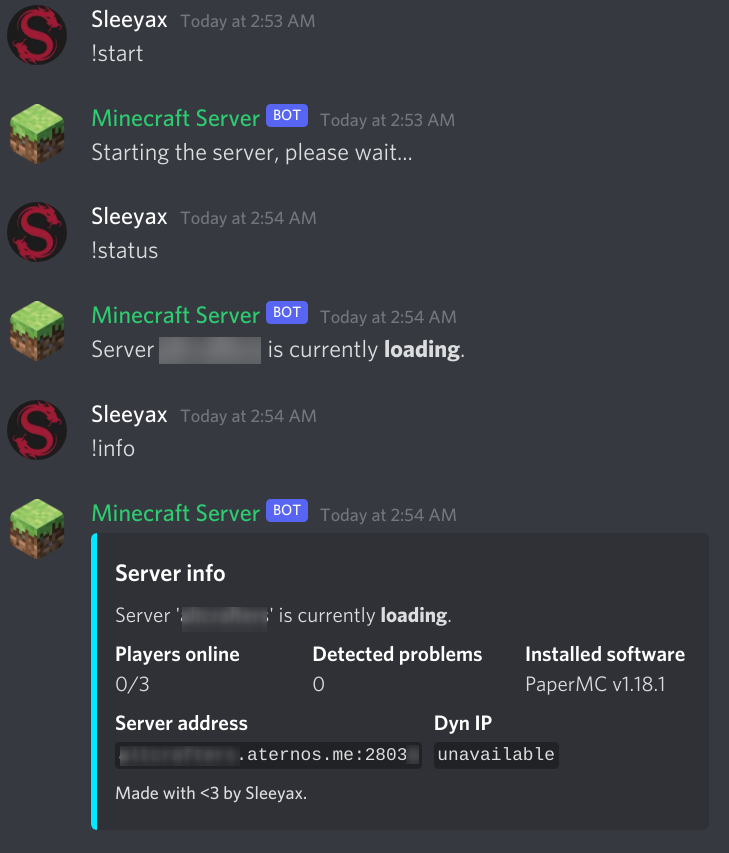
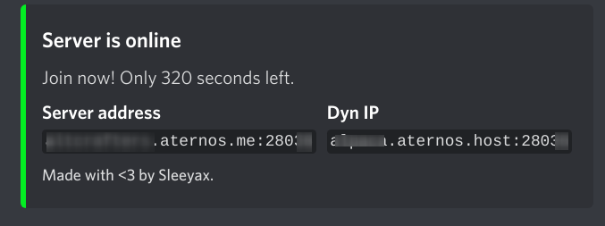

# aternos discord bot
[](https://repl.it/github/sleeyax/aternos-discord-bot)

Simple [Aternos](https://aternos.org/) discord bot to start & stop your Minecraft server.

Built using [aternos-api](https://github.com/sleeyax/aternos-api).

## Screenshots
Starting and stopping the server is fully **asynchronous**. You can query the current status at any time:



And you'll get notified once the server goes online or offline:



## Add the bot to your server
**By adding the bot to your server you automatically agree to the [TOS](TOS.md).**

Invite link: [click here](https://discord.com/api/oauth2/authorize?client_id=923372854874112000&permissions=0&scope=bot%20applications.commands).

Type `/configure` and fill in the required parameters to complete the setup.
If you're stuck with something try `/help`.
See [commands](#commands) below for details about every available command.

If you'd rather host the bot yourself, see the section about [self hosting](#self-hosting) below.

## Commands
All available slash commands.

<details>
  <summary>Click to expand</summary>

### configure
Save configuration settings for your discord server.

Parameters:

**server**

Copy and paste your `ATERNOS_SERVER` cookie here.

**session**

Copy and paste your `ATERNOS_SESSION` cookie here.

<details>
  <summary>Where are my cookies?</summary>

1. Go to your  [aternos server page](https://aternos.org/server/).
2. Make sure you're logged in and hit `CTRL + SHIFT + I` on your keyboard.
3. Then click on the tab `Storage` (Firefox) or `Application` (Chrome) to see the cookies and copy their values.
</details>

### start
Starts your minecraft server asynchronously and notifies you when it's online. Use the other commands to query the current status.

### stop
Stops your minecraft server asynchronously and notifies you when it's offline. Use the other commands to query the current status.

### help
Returns helpful resources in case you're stuck with something.

### info
Returns detailed information about your minecraft server and its status.

### status
Returns your minecraft server status. Unlike [info](#info), this only returns a short one-line status message. 

### players
Returns a list of active players.

### ping
Checks if the discord bot is still alive. It should reply with `Pong!`.

</details>

## Self-hosting
Instructions to host this bot yourself.

Requirements: 
- VPS or spare computer
- Discord bot token
- MongoDB database (optional)

Configuration parameters are set through environment variables.
Variables that don't exist or are empty `=""` will be ignored.

<details>
 <summary>Click to show all parameters</summary>

`DISCORD_TOKEN`

Create a new discord app [here](https://discord.com/developers/applications/), add a bot to the application and copy and paste the token into this environment variable.

`MONGO_DB_URI`

Mongodb [connection string](https://www.mongodb.com/docs/manual/reference/connection-string/). Create a database named `aternos-discord-bot`.
This is only required if you want to serve multiple discord servers.

`ATERNOS_SESSION`

Copy and paste your `ATERNOS_SESSION` cookie here. This is only required if you don't want to use MongoDB. Credentials are stored in memory.

`ATERNOS_SERVER`

Copy and paste your `ATERNOS_SERVER` cookie here. This is only required if you don't want to use MongoDB. Credentials are stored in memory.

`PROXY`

HTTP(S) proxy to use for all outgoing connections. This should preferably be a stable rotating proxy when applied in production.

</details>

### Builds
There's several way to get this bot up and running in production.

#### CLI binary
Download the binary from [releases](https://github.com/sleeyax/aternos-discord-bot/releases) or [compile it](#source), set the required environment variables & run the bot.

Linux/MacOS:
```
$ DISCORD_TOKEN="" MONGO_DB_URI="" ./aternos-discord-bot
``` 

Windows:
```
$ set DISCORD_TOKEN="" MONGO_DB_URI=""
$ ./aternos-discord-bot.exe
```

Other platforms:

Set the environment variables locally (or globally, if you must) and run the binary. It will show an error message when the required variables aren't set. RTFM if you don't know how to do this.

#### Source
Compilation instructions (requires Go version 1.18+):
```
$ git clone https://github.com/sleeyax/aternos-discord-bot.git
$ cd aternos-discord-bot
$ go build ./cmd/main.go
```

This should create a binary targetting your current platform. Follow the [CLI binary](#cli-binary) instructions to execute it.

#### Docker
You can also run the bot in a docker container:

`docker run -d --name aternos-discord-bot -e DISCORD_TOKEN="" -e MONGO_DB_URI="" sleeyax/aternos-discord-bot`

You can use docker compose to spin up a local MongoDB database as well (only recommended for development though):

`docker-compose up -d`

#### Kubernetes
Deployment to a kubernetes cluster is also supported. 

1. Create a new namespace (optional): `kubectl create ns aternos-discord-bot`
2. Create a new secret containing the necessary environment variables (replace `<>` with the respective values): `kubectl create secret generic aternos-secrets --from-literal=DISCORD_TOKEN=<> --from-literal=ATERNOS_SERVER=<> --from-literal=MONGO_DB_URI=<> --from-literal=ATERNOS_SESSION=<>`
3. Publish the deployment: `kubectl apply -n aternos-discord-bot -f ./kubernestes.yaml` **WARNING** you'll most likely need to edit this configuration for your specific needs. Feel free to create a PR with proper helm chart support.

#### Replit
Running the bot on replit is not recommended (by me) because it's slow and impractical, though if you really want to use it for some reason you can run or fork [this template](https://repl.it/github/sleeyax/aternos-discord-bot).
Please keep in mind that it may take a while for dependencies to install. 
You may even have to press the 'run' button several times until everything is installed properly (this is likely not an issue if you have a paid plan).

## Advanced
It's possible to integrate this package into existing go code. 
Useful if you want to further customize the bot or want to do additional things after launching it. 

Installation:

`go get github.com/sleeyax/aternos-discord-bot`

Code:
```go
package main

import (
	"fmt"
	discord "github.com/sleeyax/aternos-discord-bot"
	database "github.com/sleeyax/aternos-discord-bot/database"
	"os"
	"os/signal"
	"syscall"
)

func main() {
	// Create bot instance with an in-memory database (only supports 1 discord server).
	bot := discord.Bot{
		DiscordToken:  "<your discord bot token>",
		Database: &database.MemoryDatabase{}, // no initial values are provided, so they must be set with `/configure` later on
	}
	
	// Start the bot (errors are omitted for simplicity reasons).
	bot.Start()
	
	// Stop the bot when the main function ends.
	defer bot.Stop()
	
	// You can put some additional code here, for example. 
	//...

	// Block the main thread so the bot keeps running.
	// In this case we wait until 'CTRL + C' or another termination signal is received.
	fmt.Println("Bot is now running.  Press CTRL-C to exit.")
	interruptSignal := make(chan os.Signal, 1)
	signal.Notify(interruptSignal, syscall.SIGINT, syscall.SIGTERM, os.Interrupt, os.Kill)
	<-interruptSignal
}
```

## License
Licensed under `MIT License`.

[TL;DR](https://tldrlegal.com/license/mit-license):
> A short, permissive software license.
> Basically, you can do whatever you want as long as you include the original copyright and license notice in any copy of the software/source.
> There are many variations of this license in use.
